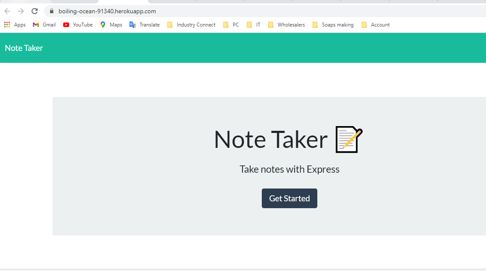
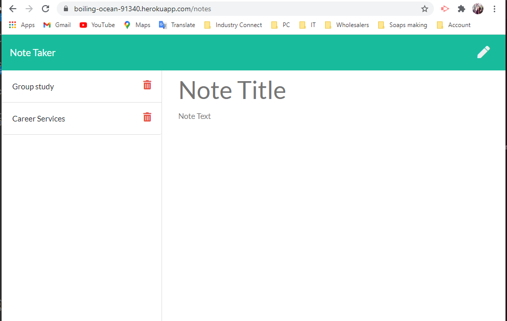

# Note Taker
    
  

## Table of Contents
- [Description](#description)
- [Installation](#installation)
- [Link to Heroku Page](#linktoherokupage)
- [Link to GitHub](#linktogithub)
- [License](#license)
- [Contributing](#contributing)
- [Questions](#questions)

## Description
An application called Note Taker that can be used to write and save notes. This application will use an Express.js back end and will save and retrieve note data from a JSON file.

## Installation
npm install express, npm install shortid, npm install

## Link to Heroku Page:
https://boiling-ocean-91340.herokuapp.com/

## Link to GitHub:
https://github.com/wendyVo/note-taker.git

## Screenshots:
-HomePage 
 

 
-Note Taker application:
 

## License

 
This application is covered under  license. 

## Contributing
Contributors: .  
Please read this [Setting guidelines for repository contributors](https://docs.github.com/en/github/building-a-strong-community/setting-guidelines-for-repository-contributors) for more informations.

## Questions

Please contact me should you have any questions:  
:email:   Email: uyen199247@gmail.com  
:octocat: GitHub:  [wendyVo](https://github.com/wendyVo)

